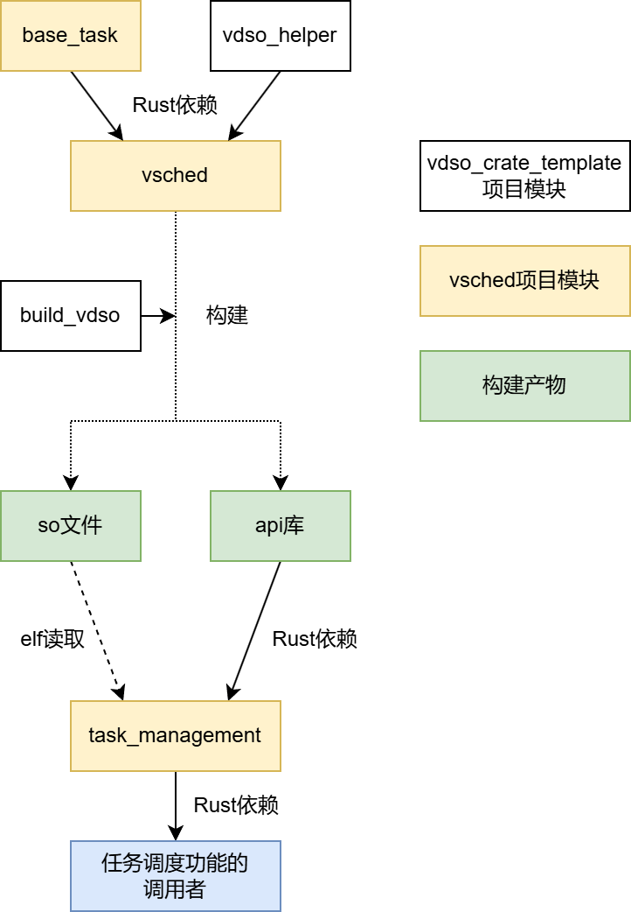
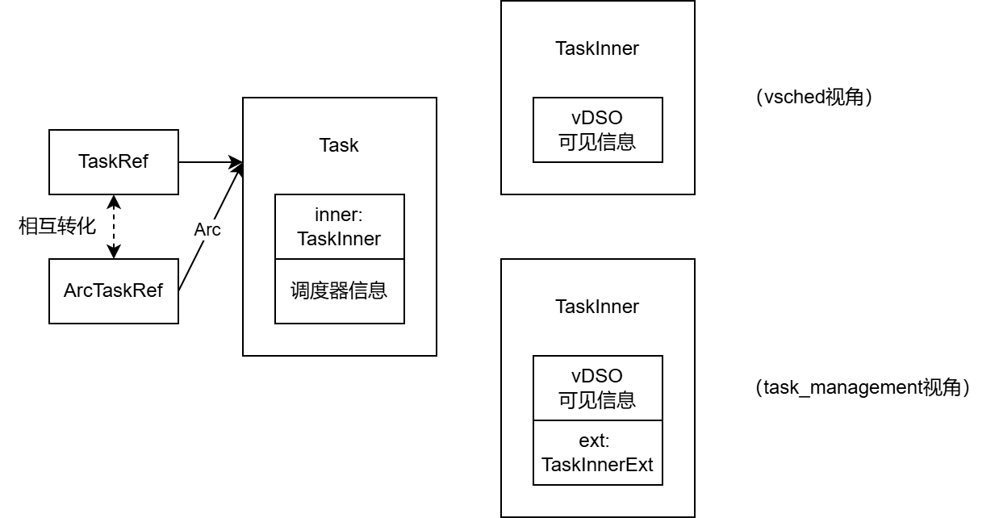

# 基于vDSO的任务调度模块

## 功能

- [x] 基于vDSO的跨地址空间共享
- [x] 线程调度和协程调度的统一
- [x] 多核调度
- [ ] 协程Waker支持
- [ ] 整合到AsyncOS中
- [ ] 进程调度
  
## 项目结构



最重要的模块为`vsched`和`task_management`。

**`vsched`**：实现为vdso共享库。其功能包括：

- 定义任务的基础数据结构`BaseTask`（其中，协程的定义需要外部提供`alloc_stack`和`coroutine_schedule`函数，因为不同地址空间的这些函数可能有不同的实现）
- 每个CPU核心的就绪队列的维护
- 从线程到线程/协程的切换

**`task_management`**：实现为普通库。其功能包括：

- 定义任务的延申数据结构`TaskExt`
- 协程相关操作（如让出、阻塞）对应的`Future`（因为`vDSO`的接口只能为普通函数，因此协程的相应接口需要在`vDSO`外部加一层`Future`包装）
- 协程的`alloc_stack`和`coroutine_schedule`函数
- 适用于线程和协程的阻塞队列
- 线程和协程的`join`操作（如果是使用相同辅助库的任务，就可以互相join）

`base_task`和`scheduler`为`vsched`的依赖库。**`base_task`** 定义了`BaseTask`任务结构，**`scheduler`** 定义了多种任务无关的调度器，同时也为任务做了一层包装以保存调度信息。

**`user_test`** 为用户态的测试代码，测试了 `init`、`spawn`、`yield`、`wait`、`multi_thread`，以及一个覆盖所有内容的`all`测例。

## 任务模型

任务数据结构如下图：



**`TaskInnerExt`**：在`task_management`中定义，对`vsched`不可见。主要包括用于退出和`join`的退出代码和退出等待队列，以及线程入口点和`Future`（协程上下文）。

**`TaskInner`（的其它字段）**：在`base_task`中定义，对`vsched`和`task_management`均可见。主要包括任务状态、使用的栈和线程上下文。

**`Task`**：在`scheduler`中定义，相较于TaskInner增加了调度器信息。

**`TaskRef`**：在`scheduler`中定义，在`vsched`中使用的任务指针。不管理引用计数。

**`ArcTaskRef`**：在`task_management`中定义，在`task_management`中使用的任务指针。管理任务的引用计数。`ArcTaskRef`通过`Arc::into_raw`转化为`TaskRef`（引用计数不变）并放入调度器。当任务退出时，再转化回`ArcTaskRef`，释放该引用计数。

## 任务切换与阻塞

由于vDSO对API的限制，在任务实际切换时采用了“线程切换在`vsched`中进行，协程切换在`task_management`中进行”的策略。但与任务切换相关的设置任务状态与调度器状态的过程，都需要两个模块配合完成。

协程的调度循环为`task_management::task::coroutine_schedule`函数。

具体的任务切换与阻塞流程如下：

### 任务的切换

线程 -> 线程：

`vsched::api::yield_now` -> `vsched::sched::yield_current`: 先维护就绪队列，再调用`resched` -> `vsched::sched::resched` -> `vsched::sched::switch_to` -> `(*prev_ctx_ptr).switch_to(&*next_ctx_ptr)`: 真正的上下文切换过程

线程 -> 协程：

同上，但是在`vsched::sched::switch_to`函数中，在上下文切换前，调用`next_task.set_kstack`（`next_task: TaskRef`） -> `base_task::TaskInner::set_kstack`: 根据协程的`alloc_stack_fn`字段指向的函数分配内核栈；根据协程的`coroutine_schedule`字段指向的函数设置任务上下文的入口点。

协程 -> 线程：

`user_test::vsched::yield_now_f` -> `YieldFuture::new().await` -> `user_test::vsched::YieldFuture::poll`: 先调用`vsched::api::yield_f`仅维护就绪队列和任务状态不执行实际切换，再返回`poll::Pending`至`user_test::task::coroutine_schedule` -> `user_test::task::coroutine_schedule`: 先通过`vsched::api::current`获取下一个要执行的任务，再通过`(*prev_ctx_ptr).switch_to(&*next_ctx_ptr)`执行上下文切换。

协程 -> 协程：

同上，但是在`user_test::task::coroutine_schedule`函数中，在上下文切换前，将自己已用完的栈传递给下一个协程。并且，不进行线程式的上下文切换，而是直接回到循环开始，运行下一个协程的`Future::poll`。

### 任务的阻塞

线程的阻塞：

`user_test::wait_queue::WaitQueue::wait` -> `user_test::vsched::blocked_resched`: 先将任务加入阻塞队列，再调用`vsched_apis::resched` -> `vsched::api::resched` -> `vsched::sched::resched`，之后同任务切换过程

协程的阻塞：

`user_test::wait_queue::WaitQueue::wait` -> `BlockedReschedFuture::new(self).await` -> `user_test::vsched::BlockedReschedFuture::poll`: 先将任务加入阻塞队列，之后调用`vsched_apis::resched_f`仅维护就绪队列不执行实际切换，之后的切换过程同协程的切换。

（协程的阻塞没有使用`Waker`相关机制，且`user_test::task::coroutine_schedule`函数中使用的`Waker`也是`Waker::noop`，因此该协程调度器不支持基于`Waker`的协程阻塞。）

## 测试

测试命令：

```
UTEST=[测例名称，即为user_test/src/bin中的文件名] make utest
```

或运行`test.sh`，会测试`yield`、`wait`和`smp`三项。